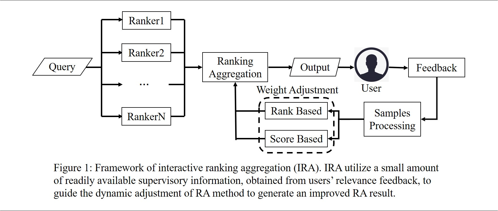

# Ranking Aggregation with Interactive Feedback for Collaborative Person Re-identification

This repo is the official implementation of ["Ranking Aggregation with Interactive Feedback for Collaborative Person Re-identification"](https://bmvc2022.mpi-inf.mpg.de/0386.pdf) by Ji Huang, Chao Liang, Yue Zhang, Zhongyuan Wang and Chunjie Zhang.

## Abstract
Person re-identification (re-ID) aims to retrieve the same person from a group of networking cameras. Ranking aggregation (RA), a method to aggregates multiple ranking results, can further improve the retrieval accuracy in re-ID tasks. Existing RA work can be generally divided into unsupervised methods and fully-supervised methods. Unsupervised methods lack external supervision, can hardly achieve the optimal results. In contrast, fully-supervised methods need massive labeling data for training, which is prohibitively expensive in the practical application. This paper studies interactive RA (IRA) to address the above challenges in existing RA research. The core idea is to utilize a small amount of supervisory information, obtained from users' relevance feedback, to supervise RA method to produce better re-ranking results. Compared with unsupervised methods, IRA introduces supervisory information and thus has better aggregation accuracy. Compared with fully-supervision methods, the supervisory information of IRA is more readily available, and can be targeted to specific queries. Particularly, we propose two IRA implementations, based on ranking positions and scores respectively, to adapt to diverse application scenarios, where rankers only give rankings, or rankers give similarity scores. Experiments on three public re-ID datasets have shown that IRA significantly outperforms the-state-of-art unsupervised baselines, and achieves similar accuracy with less labeling cost than the fully-supervised RA method.

## Approach

<div align="center">
  
</div>

## Data Format
We designe two IRA implementations, ranking-based IRA and score-based IRA, /code/Rank_based_IRA.m and /code/Score_based_IRA.m respectively. Format of the input data of both two codes is the same, include the similarity matrix and label of queries and galleries. The example of input data is also in the /code, which the similarity.mat is the sample similarity matrix; the queryID.mat and galleryID.mat is groundtruth used to simulate interaction, same label indicates same person.


## Results

|        Method        | MARKET1501 | DukeMTMC | CUHK03DETECTED | CUHK03LABELED |
|:--------------------:|:----------:|:--------:|:--------------:|:-------------:|
| IRA<sub>R</sub>(3,1) |   85.25    |  72.24   |     48.58      |     51.66     |
| IRA<sub>R</sub>(5,1) |   86.15    |  73.27   |     53.15      |     55.73     |
| IRA<sub>S</sub>(3,1) |   84.76    |  70.19   |     45.98      |     50.95     |
| IRA<sub>S</sub>(5,1) |   85.76    |  72.44   |     51.23      |     55.67     |

## Citation

If you find this repository useful, please consider giving ⭐ or citing:

```
@article{huang2022Ranking,
  title={Ranking Aggregation with Interactive Feedback for Collaborative Person Re-identification},
  author={Huang, Ji and Liang, Chao and Zhang, Yue and Wang, Zhongyuan and Zhang, Chunjie},
  journal={British Machine Vision Conference},
  year={2022}
}
```
